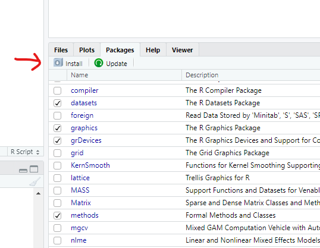

```{r setup, include=FALSE}
knitr::opts_chunk$set(echo = TRUE)
```

# Software

In this chapter we will guide you through the installation of R, RStudio and the packages you will need for this course.

**IT IS NECESSARY TO FIRST INSTALL R AND SEQUENTIALLY RSTUDIO** 

## Install R

You will need **R** installed on your computer.
**R stats** (how it is also known) is a programming language and free software environment for statistical computing and graphics supported by the R Foundation for Statistical Computing.

The download links live at [The Comprehensive R Archive Network](https://cran.r-project.org/) (aka CRAN).
The most recent version is `4.4.1`, but you can use `>= 4.1.x` if you already have it installed.

#### Windows

[Download R-4.4.1 for Windows](https://cran.r-project.org/bin/windows/base/R-4.4.1-win.exe) and run the executable file.

You will also need to install [Rtools](https://cran.r-project.org/bin/windows/Rtools/rtools44/rtools.html), which is a collection of tools necessary to build R packages in Windows.

#### Mac

[Download R-4.4.1 for MacOX](https://cran.r-project.org/).
You will have to choose between the arm64 or the x86-64 version.

Download the `.pkg` file and install it as usual.

After this installation, you don't need to open R base.
Please proceed to install RStudio.

## Install RStudio

RStudio Desktop is an integrated development environment (IDE) for R.
It includes a console, syntax-highlighting editor that supports direct code execution, as well as tools for plotting, history, debugging and workspace management.

RStudio is available for free download from [Posit RStudio](https://posit.co/download/rstudio-desktop/).

#### Windows 10/11

[Download RStudio 2024.04](https://download1.rstudio.org/electron/windows/RStudio-2024.04.2-764.exe) and run the executable file.

#### MacOS

[Download RStudio 2024.04](https://download1.rstudio.org/electron/macos/RStudio-2024.04.2-764.dmg) and install it as usual.

## R packages

Open RStudio (**not R** !).

If you type `sessionInfo()` at the console, it will show you the
packages you have with your installation.

You can install packages by the menu on the **Packages** tab  


Try to install `readxl`(to deal with MS Excel files). It will install
also some dependent packages.

You may also type in the console the packages or group of packages you’d
like to install. Try to install these three packages with the console:

-   `tidyverse`- a group of basic packages to deal with dataframes and
    graphics,
-   `RColorBrewer`- a package to use beautiful color palettes, and
-   `devtools`- a package to deal with the development versions of
    packages

Type

> install.packages(c("tidyverse","devtools","RColorBrewer"))


## Load packages

Simply by calling them in the script;

```{r echo=TRUE, message=FALSE, warning=FALSE}
library(tidyverse)
library(readxl)
```


When you restart R (`Ctrl + Shift + F10`) you’ll need to load packages
again.

## The R dashboard

### R script

You can click here at the upper left icon, and select R Script  
  
Or `Ctrl + Shift + F`  
Or in the console, type `file.edit("startup.R)`

Start by typing the aim of that script, commented with a cardinal
(**\#**)  
You can comment/uncomment any line by selecting it and press
`Ctrl + Shift + C`

Save the script.

### Working directory

Step by step:

1.  click on “Session”;
2.  Click on “Set working directory”;
3.  Click on “Choose directory” and select the folder that contains the
    dataset.

Or you could just run

``` r
setwd("D:/MQAT/Methods-Quantitative-Analysis-Transportation") #for instance
```

### Themes

`Tools > Global Options > Appearence > Editor Theme > ...`

Try to change to [Cobalt](Figures/Cobalt.png), or check others you may like.  


You can also change font, font-size, and even the panels layout.