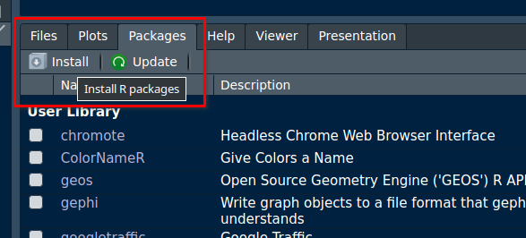

# Software

::: {.content-hidden unless-format="html"}
:::{.callout-warning collapse="true"}
## Having trouble setting up the software on your computer?

Book a slot for setup assistance using the calendar below. 

<iframe 
  src="https://calendar.app.google/yvStsqy8z4DBo1DG8" 
  style="border: 0" width="100%" height="600" 
  frameborder="0"
></iframe>
:::
:::

In this chapter we will guide you through the installation of R, Positron/RStudio IDE and the packages you will need for this course.

**R** and **Positron**/**RStudio**[^1] are separate downloads.

[^1]: We will use Positron. Although if you already use other studio such as VScode, that's also fine.

## R

You will need **R** installed on your computer.
**R stats** (how it is also known) is a programming language and free software environment for statistical computing and graphics supported by the R Foundation for Statistical Computing.

The download links live at [The Comprehensive R Archive Network](https://cran.r-project.org/){target="_blank"} (aka CRAN).
he most recent version is `4.6.1`, but you can use any `>= 4.1.x` if you already have it installed.

:::::: {.panel-tabset .nav-pills}
### Windows

[Download R for Windows](https://cran.r-project.org/bin/windows/base/){target="_blank"} and run the executable file.

::: {.callout-important icon="false"}
You may also need to install [Rtools](https://cran.r-project.org/bin/windows/Rtools/rtools45/rtools.html){target="_blank"}, which is a collection of tools necessary to build R packages in Windows.
:::

### Mac

[Download R for MacOX](https://cran.r-project.org/bin/macosx/){target="_blank"}.
You will have to choose between the *arm64* or the *x86-64* version.

Download the `.pkg` file and install it as usual.

### Ubuntu

::: {.callout-important appearance="simple"}
These are instructions for Ubuntu.
If you use other linux distribution, please follow the instructions on [The Comprehensive R Archive Network - CRAN](https://cran.r-project.org/bin/linux/){target="_blank"}.
:::

You can look for R in the Ubuntu **Software Center** or install it via the terminal:

```{bash}
# sudo apt update && sudo apt upgrade -y
sudo apt install r-base
```

**Or**, if you prefer, you can install the latest version of R from CRAN:

```{bash}
# update indices
sudo apt update -qq
# install two helper packages we need
sudo apt install --no-install-recommends software-properties-common dirmngr
# add the signing key (by Michael Rutter) for these repos
wget -qO- https://cloud.r-project.org/bin/linux/ubuntu/marutter_pubkey.asc | sudo tee -a /etc/apt/trusted.gpg.d/cran_ubuntu_key.asc
# add the R 4.0 repo from CRAN 
sudo add-apt-repository "deb https://cloud.r-project.org/bin/linux/ubuntu $(lsb_release -cs)-cran40/"
```

:::{.callout-warning appearance="simple"collapse="true"}

# Using an Ubuntu based distribution, but not pure Ubuntu?

If you are using an Ubuntu based Linux distribution, such as Linux Mint, the last command from the previous script will set the CRAN repository to an invalid address, causing the next step to throw an error when trying to fetch and install R.

To fix it, run the commands below.

```bash
# Remove invalid repository defined before
sudo add-apt-repository --remove "deb https://cloud.r-project.org/bin/linux/ubuntu $(lsb_release -cs)-cran40/"
# Set repository to fixed address, considering Ubuntu version (upstream) instead of your Ubuntu flavour one (which is invalid for CRAN)
sudo add-apt-repository "deb https://cloud.r-project.org/bin/linux/ubuntu $(source /etc/upstream-release/lsb-release && echo $DISTRIB_CODENAME)-cran40/"
```
:::

Then run:

```{bash}
sudo apt install r-base r-base-core r-recommended r-base-dev
```

::: {.callout-tip appearance="simple"}
## Optional

To keep up-to-date R version and packages, you can follow the instructions at [r2u](https://eddelbuettel.github.io/r2u/){target="_blank"}.
:::
::::::

After this installation, you don't need to open R base.
Please proceed to install RStudio.

## IDE

An IDE (Integrated Development Environment) is a software that provides tools to write, test and execute code in a single graphical interface. It makes the process of programming easier and more accessible to users less proeficient in coding.

Below are tutorials to install two alternatives that support R. Both include a console, syntax-highlighting editor that supports direct code execution, as well as tools for plotting, history, debugging and workspace management. Positron has a more modern UI, but RStudio is more established due to . You can choose either. 


### Positron

Positron is available for free download from [Posit Positron](https://positron.posit.co/download){target="_blank"}.

:::: {.panel-tabset .nav-pills}
### Windows

[Download Positron](https://positron.posit.co/download){target="_blank"} for Windows and run the executable file.

::: {.callout-note appearance="simple"}
## User or system install?

You can choose either. User install will keep Positron available only for your user, while System install will make it available to any user on your computer.
:::

::: {.callout-warning appearance="simple" collapse="true"}
## Is Positron failing to start R session?

If after successfully installing Positron you open it and face an error on the R console, installing Microsoft Visual C++ Redistributable can resolve missing dependencies that might be causing the problem.

To install it, open [this link](https://learn.microsoft.com/en-us/cpp/windows/latest-supported-vc-redist?view=msvc-170#latest-supported-redistributable-version){target="_blank"} and download the `.exe` file in the **Link** column that suits your system architecture. Click on the file and run the instalation procedure. 

Restart Positron. The issue should be gone. 
:::

### MacOS

[Download Positron](https://positron.posit.co/download){target="_blank"} for macOS file and install it as usual.

### Ubuntu

[Download Positron](https://positron.posit.co/download){target="_blank"} `.deb` file and install it as usual.
::::

### RStudio

RStudio is available for free download from [Posit RStudio](https://docs.posit.co/ide/user/#rstudio-ide-oss-downloads){target="_blank"}.

:::: {.panel-tabset .nav-pills}
### Windows

[Download RStudio IDE](https://docs.posit.co/ide/user/#rstudio-ide-oss-downloads){target="_blank"} `.exe` file and run the executable file.

### MacOS

[Download RStudio IDE](https://docs.posit.co/ide/user/#rstudio-ide-oss-downloads){target="_blank"} `.dmg` file and install it as usual.

### Ubuntu

[Download RStudio IDE](https://docs.posit.co/ide/user/#rstudio-ide-oss-downloads){target="_blank"} `.deb` file and install it as usual.
::::

## R packages

You will need to install some packages to work with the data and scripts in this course.

You can install them in RStudio by searching for them in the **Packages** tab:



**or** by running the following code in the console:

```{r}
install.packages("tidyverse")
install.packages("readxl")

install.packages("sf")
install.packages("mapview")
install.packages("rmarkdown")
install.packages("centr")
install.packages("od")
install.packages("openrouteservice")

install.packages(c("remotes", "devtools", "usethis")) # optional
install.packages("osmextract") # optional
install.packages("stplanr") # optional
```

::: {.callout-warning appearance="simple" collapse="true"}
## Facing problems installing packages on Linux?

It is possible that the instalation of the packages above fails due to missing dependencies. Unlike Windows or Mac, Linux sometimes tries to "build" packages from scratch, which causes errors if certain system tools are missing. To avoid this, follow the steps below to tell R to download ready-to-use packages instead of trying to build them.

1.  On the **Terminal** (next to the console, at the bottom of your screen, there is a tab called **Terminal**), run the command below to get your OS `codename`:

```bash
# If you are using an Ubuntu original distro, get the value at 'codename'
lsb_release -a
# If you use other Ubuntu based distro (such as Linux Mint), get the value returned by the command below
source /etc/upstream-release/lsb-release && echo $DISTRIB_CODENAME 
```

2. Back on the **Console**, run the following R code, making sure to replace 'resolute' with the codename retrieved in the previous step.

```r
# Use pre-compiled binary packages to avoid errors due to missing dependencies
options(
  repos = c(CRAN = "https://packagemanager.posit.co/cran/__linux__/resolute/latest"),
  HTTPUserAgent = sprintf("R/%s R (%s)", getRversion(), paste(getRversion(), R.version["platform"], R.version["arch"], R.version["os"]))
)

# Disable bspm interception (use pre-compiled Linux binaries directly from Posit without needing apt or system privileges)
# install.packages(c("bspm"))
bspm::disable()
```

3. All set! Try to install the packages again. It should run smoothly now. :)

:::


## Cheat sheets

::: {.callout-note appearance="simple"}
This is the only cheating allowed at this course. 😜
:::


Cheath seets are a concise set of notes used for quick reference. Posit, the open-source data science software corporation responsible for RStudio/Positron IDEs, also makes available several cheat sheets that provide a comprehensive introduction to many of R softwares and packages. 

You can start by taking a look at the ones for [Positron](https://rstudio.github.io/cheatsheets/positron.pdf){target="_blank"} or [RStudio](https://rstudio.github.io/cheatsheets/html/rstudio-ide.html){target="_blank"}.

Refer to [rstudio.github.io/cheatsheets](https://rstudio.github.io/cheatsheets/){target="_blank"} for the full cheat sheet repository.